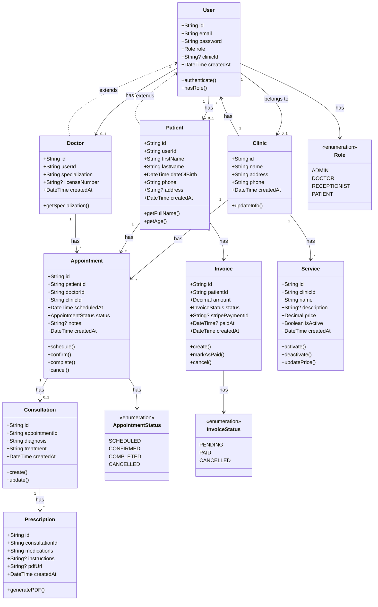

# Class Diagram - MedFlow

## Diagramme de Classes

## Description des Classes

### User
Classe de base pour tous les utilisateurs du système.
- **Attributs**: id, email, password (hashé), role, clinicId
- **Méthodes**: authenticate(), hasRole()
- **Relations**: Peut être lié à un Patient ou un Doctor

### Clinic
Représente une clinique médicale.
- **Attributs**: id, name, address, phone
- **Méthodes**: updateInfo()
- **Relations**: Contient Users, Services, Appointments

### Patient
Représente un patient de la clinique.
- **Attributs**: Informations personnelles (nom, prénom, date de naissance, etc.)
- **Méthodes**: getFullName(), getAge()
- **Relations**: A des Appointments et des Invoices

### Doctor
Représente un médecin.
- **Attributs**: specialization, licenseNumber
- **Méthodes**: getSpecialization()
- **Relations**: A des Appointments

### Appointment
Représente un rendez-vous médical.
- **Attributs**: patientId, doctorId, clinicId, scheduledAt, status, notes
- **Méthodes**: schedule(), confirm(), complete(), cancel()
- **Relations**: Lié à un Patient, un Doctor, une Clinic, et peut avoir une Consultation

### Consultation
Représente une consultation médicale après un rendez-vous.
- **Attributs**: appointmentId, diagnosis, treatment
- **Méthodes**: create(), update()
- **Relations**: Liée à un Appointment, peut avoir plusieurs Prescriptions

### Prescription
Représente une ordonnance médicale.
- **Attributs**: consultationId, medications, instructions, pdfUrl
- **Méthodes**: generatePDF()
- **Relations**: Liée à une Consultation

### Invoice
Représente une facture pour un patient.
- **Attributs**: patientId, amount, status, stripePaymentId, paidAt
- **Méthodes**: create(), markAsPaid(), cancel()
- **Relations**: Liée à un Patient

### Service
Représente un service médical offert par la clinique.
- **Attributs**: clinicId, name, description, price, isActive
- **Méthodes**: activate(), deactivate(), updatePrice()
- **Relations**: Lié à une Clinic

## Relations Principales

1. **User ↔ Clinic**: Relation many-to-one (plusieurs users peuvent appartenir à une clinique)
2. **User ↔ Patient/Doctor**: Relation one-to-one (un user est soit un patient soit un doctor)
3. **Patient ↔ Appointment**: Relation one-to-many (un patient peut avoir plusieurs rendez-vous)
4. **Doctor ↔ Appointment**: Relation one-to-many (un médecin peut avoir plusieurs rendez-vous)
5. **Appointment ↔ Consultation**: Relation one-to-one (un rendez-vous peut avoir une consultation)
6. **Consultation ↔ Prescription**: Relation one-to-many (une consultation peut avoir plusieurs prescriptions)
7. **Patient ↔ Invoice**: Relation one-to-many (un patient peut avoir plusieurs factures)
8. **Clinic ↔ Service**: Relation one-to-many (une clinique peut avoir plusieurs services)

