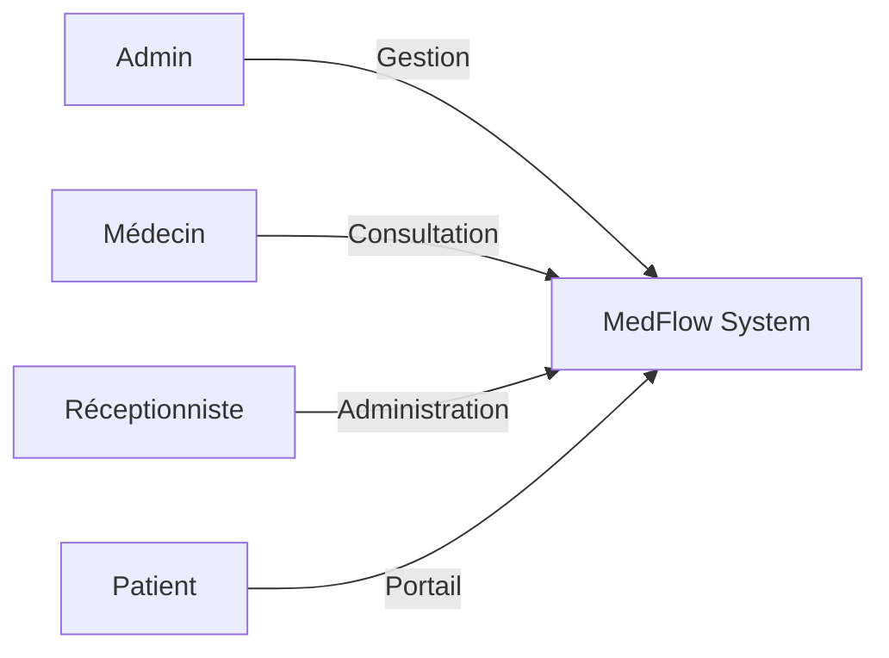

# MedFlow - Diagrammes UML

Ce document contient les diagrammes de cas d'utilisation et de classes pour l'application MedFlow.

## 📋 Table des Matières

1. [Use Case Diagram](#use-case-diagram)
2. [Class Diagram](#class-diagram)

---

## Use Case Diagram

Le diagramme de cas d'utilisation montre les interactions entre les différents acteurs (Admin, Médecin, Réceptionniste, Patient) et le système.

### Acteurs

- **👨‍💼 Admin**: Gestionnaire de la clinique
- **👨‍⚕️ Médecin**: Professionnel de santé
- **👩‍💼 Réceptionniste**: Personnel administratif
- **🤖 Patient**: Utilisateur final
- **⚙️ Système**: Processus automatiques

### Vue d'ensemble

Voir le [diagramme complet](./use-case-diagram.md) pour tous les cas d'utilisation.

---

## Class Diagram

Le diagramme de classes montre la structure des entités et leurs relations dans le système.

### Entités Principales

1. **User**: Utilisateur de base avec authentification
2. **Clinic**: Clinique médicale
3. **Patient**: Patient de la clinique
4. **Doctor**: Médecin
5. **Appointment**: Rendez-vous médical
6. **Consultation**: Consultation médicale
7. **Prescription**: Ordonnance médicale
8. **Invoice**: Facture
9. **Service**: Service médical

### Relations Clés

- User → Patient/Doctor (héritage via relation)
- Patient → Appointment (1:N)
- Doctor → Appointment (1:N)
- Appointment → Consultation (1:1)
- Consultation → Prescription (1:N)
- Patient → Invoice (1:N)
- Clinic → Service (1:N)

Voir le [diagramme complet](./class-diagram.md) pour tous les détails.

---

## 📊 Visualisation

Pour visualiser ces diagrammes :

1. **Dans VS Code**: Installez l'extension "Markdown Preview Mermaid Support"
2. **En ligne**: Utilisez [Mermaid Live Editor](https://mermaid.live/)
3. **Dans GitHub**: Les diagrammes Mermaid sont automatiquement rendus

---

## 🔄 Mise à jour

Ces diagrammes doivent être mis à jour lorsque :
- De nouvelles fonctionnalités sont ajoutées
- De nouvelles entités sont créées
- Les relations entre entités changent
- De nouveaux rôles sont introduits

