# Use Case Diagram - MedFlow

## Diagramme de Cas d'Utilisation

```mermaid
graph TB
    %% Acteurs
    Admin[Admin]
    Doctor[Médecin]
    Receptionist[Réceptionniste]
    Patient[Patient]
    System[Système]

    %% Cas d'utilisation Admin
    Admin --> UC1[Gérer les Patients]
    Admin --> UC2[Gérer les Médecins]
    Admin --> UC3[Gérer le Staff]
    Admin --> UC4[Configurer les Services]
    Admin --> UC5[Voir les Statistiques]
    Admin --> UC6[Gérer les Rendez-vous]
    Admin --> UC7[Gérer les Factures]
    Admin --> UC8[Configurer la Clinique]

    %% Cas d'utilisation Médecin
    Doctor --> UC9[Voir Mon Agenda]
    Doctor --> UC10[Consulter Dossiers Patients]
    Doctor --> UC11[Créer Consultation]
    Doctor --> UC12[Générer Ordonnance]
    Doctor --> UC13[Voir Mes Consultations]
    Doctor --> UC14[Voir Mes Prescriptions]

    %% Cas d'utilisation Réceptionniste
    Receptionist --> UC15[Créer Rendez-vous]
    Receptionist --> UC16[Modifier Rendez-vous]
    Receptionist --> UC17[Enregistrer Patient]
    Receptionist --> UC18[Modifier Patient]
    Receptionist --> UC19[Créer Facture]
    Receptionist --> UC20[Voir Factures]
    Receptionist --> UC6

    %% Cas d'utilisation Patient
    Patient --> UC21[Réserver Rendez-vous]
    Patient --> UC22[Modifier Rendez-vous]
    Patient --> UC23[Annuler Rendez-vous]
    Patient --> UC24[Voir Mes Factures]
    Patient --> UC25[Payer Facture]
    Patient --> UC26[Télécharger Ordonnance]
    Patient --> UC27[Voir Mes Prescriptions]

    %% Cas d'utilisation Système
    System --> UC28[Authentification]
    System --> UC29[Générer Facture Automatique]
    System --> UC30[Traiter Paiement Stripe]
    System --> UC31[Générer PDF Ordonnance]

    %% Relations
    UC6 -.-> UC9
    UC11 -.-> UC29
    UC25 -.-> UC30
    UC12 -.-> UC31
```

## Description des Cas d'Utilisation

### Admin
- **UC1**: Gérer les Patients - CRUD complet sur les patients
- **UC2**: Gérer les Médecins - Ajouter, modifier, supprimer des médecins
- **UC3**: Gérer le Staff - Gérer les réceptionnistes
- **UC4**: Configurer les Services - Définir services et tarifs
- **UC5**: Voir les Statistiques - Dashboard avec stats de la clinique
- **UC6**: Gérer les Rendez-vous - Voir tous les rendez-vous
- **UC7**: Gérer les Factures - Voir toutes les factures
- **UC8**: Configurer la Clinique - Modifier infos de la clinique

### Médecin
- **UC9**: Voir Mon Agenda - Rendez-vous du médecin
- **UC10**: Consulter Dossiers Patients - Accès aux dossiers médicaux
- **UC11**: Créer Consultation - Après un rendez-vous
- **UC12**: Générer Ordonnance - Créer prescription médicale
- **UC13**: Voir Mes Consultations - Historique des consultations
- **UC14**: Voir Mes Prescriptions - Liste des ordonnances créées

### Réceptionniste
- **UC15**: Créer Rendez-vous - Planifier un rendez-vous
- **UC16**: Modifier Rendez-vous - Changer date/heure/statut
- **UC17**: Enregistrer Patient - Créer nouveau patient
- **UC18**: Modifier Patient - Mettre à jour infos patient
- **UC19**: Créer Facture - Générer facture manuellement
- **UC20**: Voir Factures - Liste des factures
- **UC6**: Gérer les Rendez-vous - Voir tous les rendez-vous

### Patient
- **UC21**: Réserver Rendez-vous - Prendre rendez-vous en ligne
- **UC22**: Modifier Rendez-vous - Changer date/heure
- **UC23**: Annuler Rendez-vous - Annuler un rendez-vous
- **UC24**: Voir Mes Factures - Liste de ses factures
- **UC25**: Payer Facture - Paiement via Stripe
- **UC26**: Télécharger Ordonnance - Télécharger PDF
- **UC27**: Voir Mes Prescriptions - Liste de ses ordonnances

### Système
- **UC28**: Authentification - Login/Register avec NextAuth
- **UC29**: Générer Facture Automatique - Après consultation
- **UC30**: Traiter Paiement Stripe - Webhook Stripe
- **UC31**: Générer PDF Ordonnance - Export PDF avec pdfkit
